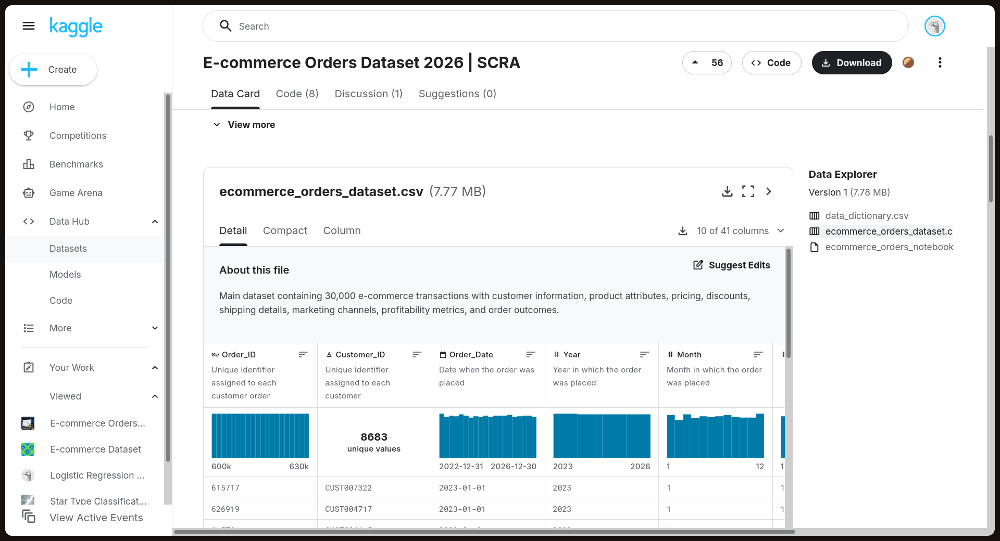
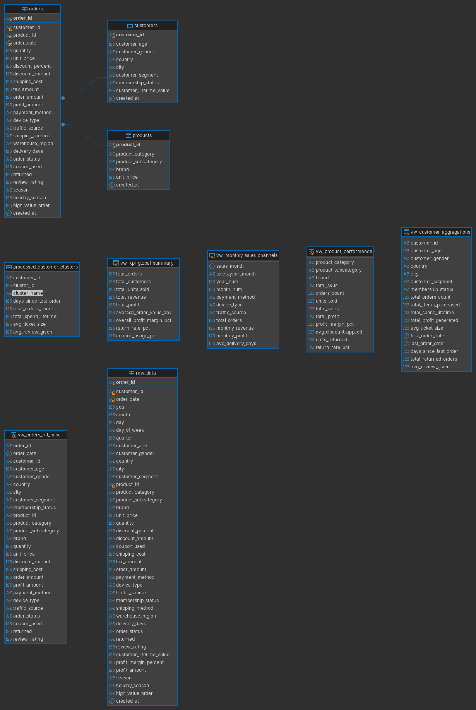
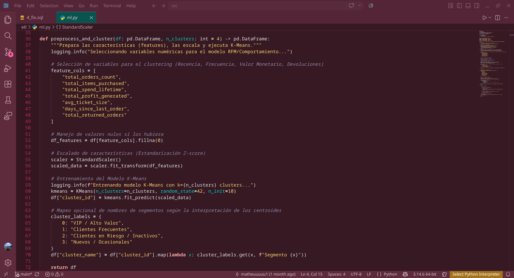
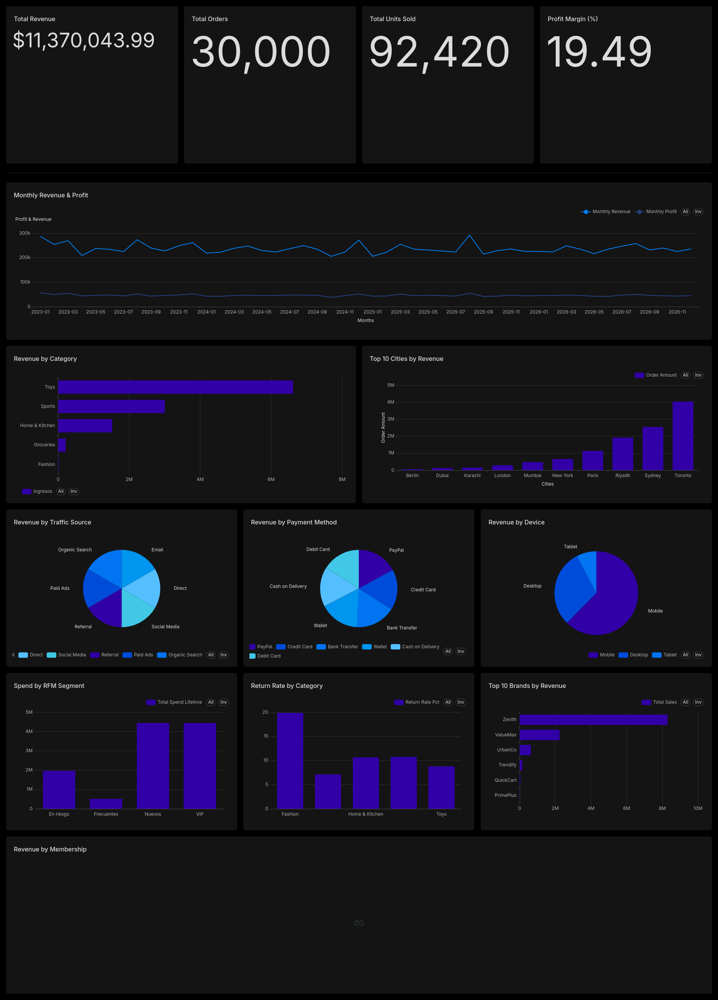

# 🛒 Retail — Pipeline de Análisis E-Commerce

Pipeline **ETL de extremo a extremo** sobre un dataset público de órdenes de e-commerce (Kaggle): desde la ingesta cruda en MariaDB, pasando por normalización, vistas analíticas, **segmentación de clientes con K-Means**, análisis estadístico en **R** y visualización ejecutiva en **Power BI / web**.

## ✅ Estado del pipeline

| Fase | Descripción | Herramientas | Estado |
|------|-------------|--------------|--------|
| 0 | Ingesta del dataset | Python (`kagglehub`) | ✅ |
| 1 | Carga cruda, normalización y vistas | SQL / MariaDB | ✅ |
| 2 | ETL + segmentación (K-Means) | Python (`pandas`, `scikit-learn`, `SQLAlchemy`) | ✅ |
| 3 | Análisis estadístico y reporte técnico | R (`ggplot2`, R Markdown) | ⏳ pendiente |
| 4 | Dashboard ejecutivo + web interactiva | Power BI · HTML/CSS/JS (Plotly) | ⏳ pendiente |

> Diagrama de arquitectura completo (Mermaid): [`docs/pipeline_architecture.md`](docs/pipeline_architecture.md)

## 🏗️ Arquitectura

```
Kaggle ──▶ CSV crudo ──▶ MariaDB (raw_data) ──▶ Modelo normalizado ──▶ Vistas SQL
                                                        │
                                                Python (SQLAlchemy)
                                                        │
                                             pandas + K-Means (RFM)
                                                        │
                                              processed_customer_clusters
                                                        │
                                    ┌───────────────────┴───────────────────┐
                                 R (hipótesis, ggplot2,          Power BI / Web
                                 R Markdown reporte)            (dashboard)
```

## 🧰 Tecnologías

- **Base de datos:** MariaDB (MySQL-compatible)
- **ETL / ML:** Python — `pandas`, `scikit-learn`, `SQLAlchemy`, conector oficial `mariadb`
- **Análisis:** R — `ggplot2`, `stats`, R Markdown
- **Visualización:** Power BI · HTML/CSS/JS (Plotly / Streamlit)

## 📁 Estructura del proyecto

```
.
├── data/raw/                 # CSV descargado (gitignored)
├── docs/
│   └── pipeline_architecture.md  # Diagrama y estado del pipeline
├── src/
│   ├── etl/
│   │   ├── 1_raw.sql         # Fase 1: tabla cruda + LOAD DATA
│   │   ├── 2_structure.sql   # Fase 1: normalización (customers/products/orders)
│   │   ├── 4_fix.sql         # Fase 1: vistas analíticas
│   │   └── ml.py             # Fase 2: ETL + K-Means
│   └── func/
│       └── down.py           # Fase 0: descarga del dataset (kagglehub)
└── README.md
```

## 🚀 Cómo ejecutar

### Requisitos
- **MariaDB** corriendo en local (puerto 3306 por defecto)
- **Python 3.12+** con: `pandas`, `scikit-learn`, `sqlalchemy`, `mariadb` (conector oficial)
- **R** + `DBI`, `RMariaDB`/`RMySQL`, `ggplot2`, `rmarkdown` *(para la Fase 3)*

### Fase 0 — Descarga del dataset
```bash
python src/func/down.py
```
Descarga `ecommerce_orders_dataset.csv` desde Kaggle y lo deja en `data/raw/`.

### Fase 1 — MariaDB / SQL
```bash
mysql -u root -p < src/etl/1_raw.sql        # tabla cruda + carga del CSV
mysql -u root -p < src/etl/2_structure.sql  # normalización (3 tablas)
mysql -u root -p < src/etl/4_fix.sql        # vistas analíticas
```

### Fase 2 — ETL + Machine Learning
```bash
python src/etl/ml.py
```
Lee `vw_customer_aggregations`, estandariza features tipo RFM y ejecuta **K-Means (k=4)**. Los segmentos se guardan en la tabla `processed_customer_clusters`.

Conexión por variables de entorno: `DB_USER`, `DB_PASS`, `DB_HOST`, `DB_PORT`, `DB_NAME`.

### Fase 3 y 4 — R y visualización *(en desarrollo)*
Análisis estadístico con R y dashboards en Power BI / web.

## 📊 Resultados validados (2026-08-04)

Dataset de **30,000 órdenes**:

| Métrica | Valor |
|---------|-------|
| Órdenes / Clientes / Productos | 30,000 / 8,683 / 2,500 |
| Ingresos totales | $11.37M |
| Ticket promedio (AOV) | $379 |
| Margen de ganancia | 19.49% |
| Tasa de devolución | 10.11% |
| Uso de cupones | 68.10% |

**Segmentos de clientes (K-Means):** VIP/Alto Valor (935) · Frecuentes (3,787) · En Riesgo/Inactivos (2,156) · Nuevos/Ocasionales (1,805).

## 📸 Evidencias del pipeline

Recorrido visual del proyecto: de la fuente de datos al resultado final.

### Captura 1 — Dataset fuente (Kaggle)



**Qué se ve en la imagen:** la página del dataset *E-Commerce Orders Dataset 2026* en Kaggle, el origen real de los datos: ~30,000 órdenes y 41 columnas en el archivo `ecommerce_orders_dataset.csv`. Todo arranca aquí: `src/func/down.py` lo descarga con `kagglehub` (Fase 0).

### Captura 2 — Modelo normalizado en la base de datos



**Qué se ve en la imagen:** el esquema de la base `ecommerce_orders` (DBeaver o diagrama ERD): la tabla cruda `raw_data` como staging fiel al CSV, normalizada en `customers`, `products` y `orders` con claves foráneas, más las 5 vistas analíticas (`vw_*`) listas para consumo analítico. Es el resultado de la Fase 1 (SQL / MariaDB): de datos sucios a modelo listo para el negocio.

### Captura 3 — Código de la segmentación K-Means



**Qué se ve en la imagen:** la función `preprocess_and_cluster()` de `src/etl/ml.py`: selección de features tipo RFM (`total_spend_lifetime`, `days_since_last_order`, `total_returned_orders`, …), estandarización con `StandardScaler` y entrenamiento de **K-Means con k=4**, seguido del mapeo de cada cluster a un segmento de negocio (VIP / Frecuentes / En Riesgo / Ocasionales). Es la Fase 2.

### Captura 4 — Dashboard ejecutivo



**Qué se ve en la imagen:** el dashboard con los KPIs globales del negocio (ingresos **$11.37M**, ticket promedio **$379**, margen **19.49%**, devoluciones **10.11%**, uso de cupones **68.10%**) y la distribución de los segmentos de clientes. Es donde converge todo el pipeline (Fase 4).

## 🔐 Seguridad

Las credenciales están **gitignored** (`.claude/`, `kaggle.json`). Configura las tuyas localmente sin subirlas al repositorio. La contraseña de la BD se maneja por variable de entorno.

## 📄 Licencia

Proyecto académico/portafolio. Dataset: [E-Commerce Orders Dataset 2026](https://www.kaggle.com/datasets/mmumairkhattak/e-commerce-orders-dataset-2026-scra) (Kaggle, uso no comercial).
