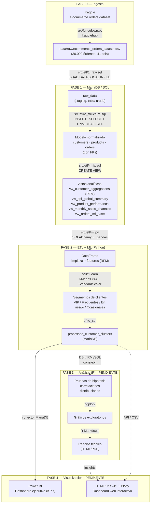

# Pipeline de Análisis E-Commerce — Arquitectura y Flujo de Trabajo

> Documento vivo. Mapa de extremo a extremo: qué se hace, con qué programa, en qué orden, y qué archivos del repo le corresponden a cada paso.

## 1. Diagrama de flujo

## 2. Mapa por fase: programa → acción → archivo

| Fase | Programa | Acción | Entrada | Salida | Archivo en repo | Estado |
|------|----------|--------|---------|--------|------------------|--------|
| 0 | Python (`kagglehub`) | Descarga dataset | Kaggle | CSV crudo | `src/func/down.py` | ✅ hecho |
| 1 | SQL (MariaDB) | Tabla staging + carga | CSV | `raw_data` | `src/etl/1_raw.sql` | ✅ hecho* |
| 1 | SQL (MariaDB) | Normalizar en 3 tablas + FKs | `raw_data` | `customers`, `products`, `orders` | `src/etl/2_structure.sql` | ✅ hecho |
| 1 | SQL (MariaDB) | Vistas optimizadas para consumo | `orders` + dims | 5 vistas analíticas | `src/etl/4_fix.sql` | ✅ hecho |
| 2 | Python (`SQLAlchemy`/`pandas`) | Extraer vistas → df, limpiar | vistas | DataFrame limpio | `src/etl/ml.py` | ✅ hecho |
| 2 | Python (`scikit-learn`) | KMeans segmentación | df RFM | `cluster_id` + `cluster_name` | `src/etl/ml.py` | ✅ hecho |
| 2 | Python (`to_sql`) | Cargar resultados | df clusters | `processed_customer_clusters` | `src/etl/ml.py` | ✅ hecho |
| 2 | Python | *(opcional)* cargar df limpio completo | df limpio | `processed_orders` | — | ❌ falta |
| 3 | R (`DBI`, `ggplot2`, Rmd) | Hipótesis, correlaciones, distribuciones | tablas procesadas | reporte técnico R Markdown | — | ❌ falta |
| 4 | Power BI | Dashboard de KPIs directivos | MariaDB/CSV | `.pbix` | — | ❌ falta |
| 4 | HTML/CSS/JS + Plotly | Dashboard web interactivo | datos procesados | página web | — | ❌ falta |

\* tiene un bug en la ruta del `LOAD DATA` (ver sección 4).

## 3. Flujo lógico del pipeline (resumen)

1. **Kaggle** → CSV crudo (`down.py`)
2. **MariaDB** → staging (`1_raw.sql`) → modelo normalizado (`2_structure.sql`) → vistas (`4_fix.sql`)
3. **Python** → extrae vistas, limpia, crea variables (RFM), corre **KMeans**, devuelve a MariaDB (`ml.py`)
4. **R** → análisis estadístico sobre lo ya procesado + reporte R Markdown *(pendiente)*
5. **Power BI** (dashboard ejecutivo) y **HTML/Web** (dashboard interactivo) *(pendiente)*

## 4. Problemas encontrados en el código actual

1. **Bug — ruta del `LOAD DATA`** (`src/etl/1_raw.sql:59`): ✅ **CORREGIDO**
   La ruta apuntaba a `'C:/Git/Retail/data/raw/...'` (faltaba ` (WIP)`). Ahora apunta a `'C:/Git/Retail (WIP)/data/raw/ecommerce_orders_dataset.csv'`.
   > ⚠️ Ojo: el servidor MariaDB es el que lee la ruta. Si es remoto/cloud, la ruta debe ser del servidor, no local.

2. **Driver inconsistente** (`src/etl/ml.py`): ✅ **CORREGIDO**
   El comentario *"Usamos pymysql como driver"* era engañoso (la URL usa `mariadb+mariadbconnector://`). El comentario se eliminó; la URL real manda.

3. **Bug de datos — columnas `Yes/No` cargadas como `0`** (`1_raw.sql` + `2_structure.sql`): ✅ **CORREGIDO**
   `Returned`, `Coupon_Used`, `Holiday_Season` y `High_Value_Order` vienen como texto `Yes/No` en el CSV, pero el esquema las tenía como `TINYINT`, así que `LOAD DATA` las cargó todas en `0` (los KPIs de devolución/cupón daban `0.00` y la feature `total_returned_orders` del ML quedaba en ceros).
   **Fix aplicado:** `raw_data` las guarda como `VARCHAR(5) 'Yes'/'No'` (fiel al CSV, como pide el brief) y el `INSERT` de `orders` las convierte con `CASE WHEN TRIM(col) = 'Yes' THEN 1 ELSE 0 END`.
   **Validado (2026-08-04):** `return_rate_pct` 10.11%, `coupon_usage_pct` 68.10%.

3. **Dataset "de ropa" vs. general**: El brief dice *e-commerce de ropa*, pero el dataset actual es general (8 categorías: Beauty, Books, Electronics, Fashion, Groceries, Home & Kitchen, Sports, Toys). `Fashion` es solo una de ellas. Hay que decidir si se analiza todo o se filtra a `Fashion`.

## 5. Decisiones / incertidumbres a resolver

- [x] **¿Dataset de ropa o general?** **Decidido (2026-08-04):** analizar el dataset completo (general, 8 categorías). `Fashion` es solo una de ellas, no se filtra.
- [ ] **¿MariaDB local o remoto?** La ruta del `LOAD DATA` y la conexión cambian según dónde corra el servidor.
- [ ] **¿Driver Python?** `pymysql` vs `mariadb-connector` (elegir uno y fijarlo en `requirements.txt`).
- [ ] **¿`processed_orders`?** El brief menciona cargar el df limpio completo, no solo los clusters. ¿Se agrega?
- [ ] **Fase 3 (R):** ¿`1_conn.R` se recrea? ¿Reporte R Markdown en HTML o PDF?
- [ ] **Fase 4:** ¿Power BI, web (Plotly/Streamlit), o ambas? El brief las pone como Opción A/B pero en el resumen personal mencionas ambas.
- [ ] **Segmentación:** ¿KMeans es suficiente o se agrega predicción de compra (el brief lo deja como "Extra")?

## 6. Siguiente paso recomendado (Fase 1)

1. ✅ Corregir la ruta del `LOAD DATA` en `1_raw.sql` — **hecho (2026-08-04)**.
2. ✅ Verificar duplicados de `order_id` en el CSV — **hecho: 0 duplicados** (30,000 filas, 30,000 IDs únicos).
3. ✅ Corregir bug de columnas `Yes/No` → `0` — **hecho (2026-08-04)**.
4. ✅ **FASE 1 EJECUTADA en MariaDB local (2026-08-04)** — `raw_data` 30,000 / `customers` 8,683 / `products` 2,500 / `orders` 30,000. 5 vistas creadas. KPIs validados (return_rate 10.11%, coupon 68.10%, revenue $11.37M).
5. ✅ **FASE 2 EJECUTADA (2026-08-04)** — Conector `mariadb` 1.1.14 instalado en Python 3.14 (wheel disponible; Python 3.12 queda como respaldo). `ml.py` corrió de punta a punta: KMeans k=4 sobre `vw_customer_aggregations` → tabla `processed_customer_clusters` (8,683 filas). Distribución: VIP 935 · Frecuentes 3,787 · En Riesgo 2,156 · Ocasionales 1,805.
6. ⏭ **Siguiente: Fase 3 (R)** — análisis estadístico; y **Fase 4** (Power BI / web).
